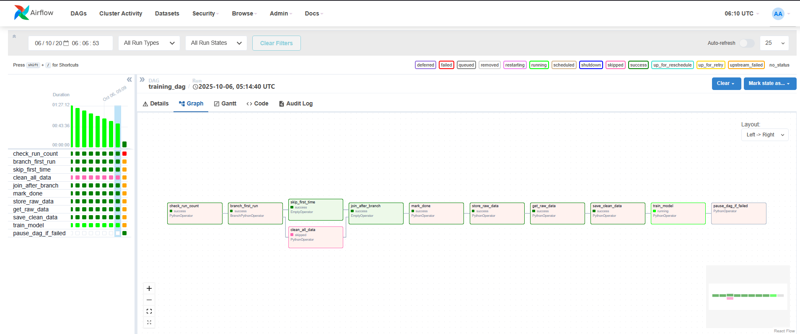
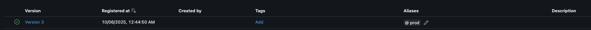
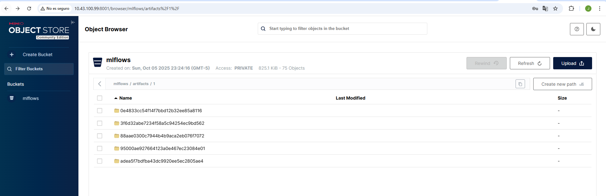
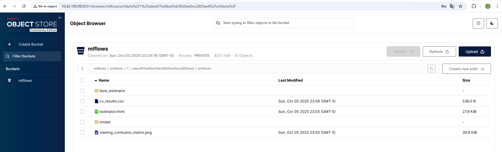
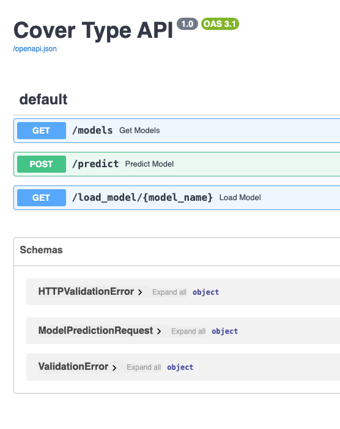
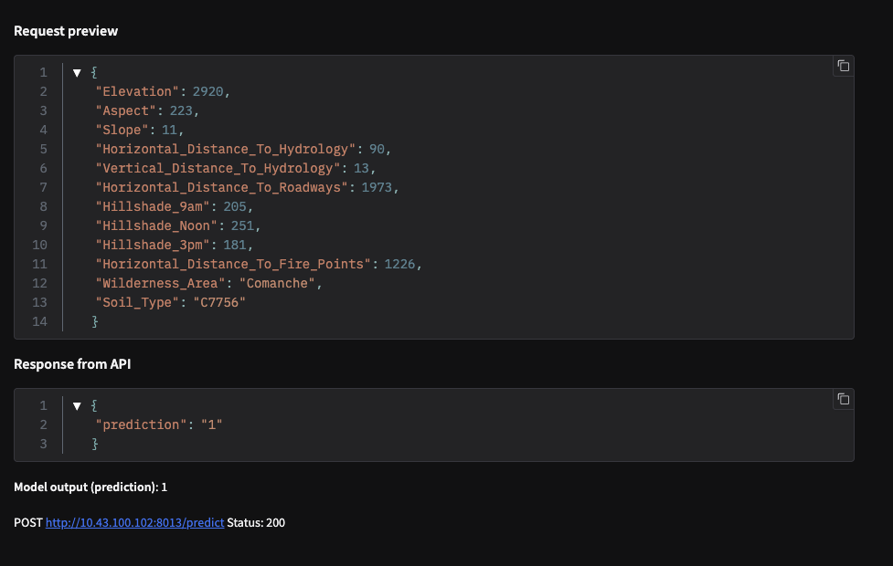
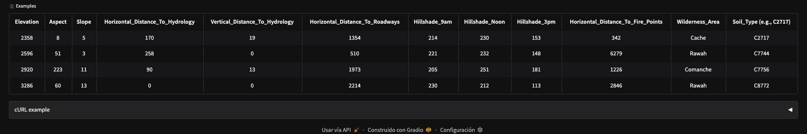
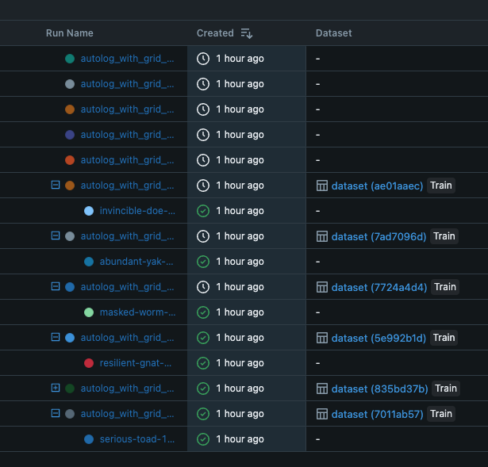
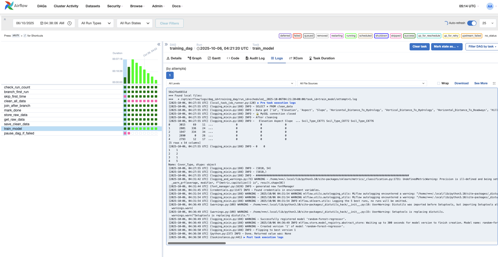

# 🌲 MLOps - Talleres Clasificador de Cover Type

<div align="center">


</div>

Este repositorio contiene el código usado para entrenar y desplegar un modelo de predicción de tipos de cobertura forestal basado en el dataset de Cover Type. El proyecto abarca desde la preparación de datos y el entrenamiento de modelos hasta el desplieque de una API REST y aplicación web para realizar predicciones, con integración completa de MLflow para gestión de modelos.

---

## Arquitectura de Servicios

- **Servicio de Predicción**: API REST con FastAPI para inferencia de modelos MLflow
- **Interfaz Web**: Aplicación Gradio para predicciones interactivas
- **Orquestación de Workflows**: Apache Airflow para automatización y programación de tareas de ML
- **Model Registry**: MLflow para gestión y versionado de modelos
- **Almacenamiento de Objetos**: MinIO (S3-compatible) para artefactos de MLflow
- **Base de Datos de Entrenamiento**: MySQL para almacenamiento de datos de entrenamiento
- **Base de Datos MLflow**: MySQL para metadatos de experimentos y modelos
- **Volúmenes Compartidos**: Sistema de archivos compartido para modelos entrenados y logs

### Componentes de Airflow

- **Airflow Webserver**: Interfaz web para monitoreo y gestión de DAGs (puerto 8080)
- **Airflow Scheduler**: Planificador de tareas que ejecuta los DAGs según su programación
- **Airflow Worker**: Ejecutor de tareas usando Celery
- **Airflow Triggerer**: Manejo de sensores y triggers asíncronos
- **PostgreSQL**: Base de datos de metadatos de Airflow
- **Redis**: Broker de mensajes para Celery

### Componentes de MLflow

- **MLflow Tracking Server**: Servidor para tracking de experimentos (puerto 8003)
- **MLflow Model Registry**: Registro centralizado de modelos con versionado
- **MinIO Storage**: Almacenamiento S3-compatible para artefactos (puerto 8000)
- **MySQL MLflow DB**: Base de datos para metadatos de MLflow (puerto 8004)

## Entrenamiento de Modelos

### Workflow Automatizado con Airflow + MLflow

El entrenamiento de modelos se ejecuta mediante un DAG (Directed Acyclic Graph) de Airflow que automatiza todo el proceso con integración completa de MLflow:

1. **check_run_count**: Verifica el número de ejecuciones (máximo 11)
2. **branch_first_run**: Determina si es la primera ejecución
3. **clean_all_data**: Limpia datos anteriores de la base de datos (solo primera vez)
4. **store_raw_data**: Descarga y almacena datos frescos del dataset
5. **get_raw_data**: Extrae y procesa los datos para entrenamiento
6. **save_clean_data**: Guarda datos limpios para entrenamiento
7. **train_model**: Entrena modelo con MLflow y actualiza el alias de producción

### Características del Entrenamiento

- **Automatización completa**: El DAG se ejecuta cada 5 minutos y 20 segundos
- **Integración MLflow**: Tracking automático de experimentos y métricas
- **Model Registry**: Gestión centralizada de versiones de modelos
- **Selección automática**: El mejor modelo se promociona automáticamente a producción
- **Persistencia en S3**: Artefactos almacenados en MinIO (S3-compatible)
- **Monitoreo en tiempo real** a través de las interfaces de Airflow y MLflow
- **Notebook interactivo** (TrainModels.ipynb) disponible para experimentación manual

## Mejoras en la API

- Endpoint para listado de modelos disponibles

- Sistema de normalización de datos de entrada

- Manejo de errores mejorado

- Documentación interactiva automática

## Creación del modelo

- El dataset se carga usando el método `load_penguins` expuesto en la librería del proyecto `palmerpenguins`.  
- Se convierten columnas categóricas a numéricas usando One-shot Encoding.
- Se hace una escala para mantener la desviación estandar por debajo de 1.
- Se eliminan características no representativas para los modelos(year).
---

## ✨ Características principales

<div align="center">

| 🌲 **ETL** | 🤖 **ML** | 🚀 **API** | 🌐 **Web** |
|------------|-----------|------------|------------|
| Preparación de datos Cover Type | Random Forest + GridSearch | FastAPI + MLflow | Gradio interactivo |
| Transformaciones automáticas | Tracking automático | Documentación automática | Ejemplos predefinidos |

</div>

<div align="center">

| 📦 **Infraestructura** | ⚡ **Orquestación** | 🗄️ **Almacenamiento** | 📈 **Monitoreo** |
|----------------------|-------------------|---------------------|------------------|
| Docker Compose | Apache Airflow | MinIO S3 | Interfaces web |
| Multi-servicio | DAGs automatizados | MySQL dual | Logs en tiempo real |
| Hot reload | Cada 5 minutos | Model Registry | Métricas MLflow |

</div>

---

## 🚀 Instalación y configuración

### 📋 Prerrequisitos

<div align="center">

| 🔧 **Requisito** | ✅ **Descripción** |
|------------------|-------------------|
| **Docker** | Docker y Docker Compose instalados |
| **RAM** | Al menos 8GB de RAM disponible |
| **Puertos** | Puertos 8000-8012, 8080 disponibles |

</div>

### Clonar el repositorio

```bash
git clone https://github.com/JonatanGallo/MLOps---Talleres.git
cd MLOps---Talleres/proyecto_2
```

### Ejecución con Docker Compose

Construcción y ejecución de todos los servicios:

```bash
# Construir y ejecutar todos los servicios
docker-compose up --build

# Ejecutar en segundo plano
docker-compose up -d

# Ver logs de servicios específicos
docker-compose logs -f airflow-webserver
docker-compose logs -f mlflow
docker-compose logs -f prediction
```

### Verificación de Servicios

Una vez iniciados los servicios, verificar que todos estén funcionando:

```bash
# Verificar estado de contenedores
docker-compose ps

# Verificar logs de servicios
docker-compose logs --tail=50
```

## Servicios desplegados

<div align="center">

| 🚀 **Servicio** | 🌐 **URL** | 🔑 **Credenciales** |
|----------------|------------|-------------------|
| **API de Predicción** | http://10.43.100.102:8012 | - |
| **Interfaz Web Gradio** | http://10.43.100.102:8014 | - |
| **Airflow Webserver** | http://10.43.100.102:8080 | airflow / airflow |
| **MLflow Tracking Server** | http://10.43.100.102:8003 | - |
| **MinIO Console** | http://10.43.100.99:8000 | admin / supersecret |
| **MySQL Training DB** | http://10.43.100.86:8085 | user / password |
| **MySQL MLflow DB** | http://10.43.100.99:8004 | user / password |

</div>

## Entrenamiento de modelos

### Entrenamiento Automatizado con Airflow

1. **Acceder a Airflow**: Abrir http://10.43.100.102:8080 en el navegador
2. **Credenciales**: Usuario: `airflow`, Contraseña: `airflow`
3. **Ejecutar DAG**: Buscar el DAG `training_dag` y activarlo
4. **Monitorear**: Ver el progreso de las tareas en tiempo real

### Entrenamiento Manual (Opcional)

Para experimentación manual, se puede usar el notebook disponible:

```python
# Ejemplo de entrenamiento desde el notebook
from etl import get_data
from model import Model
from models import ModelType

X, y = get_data()
model = Model(ModelType.RANDOM_FOREST)
model.train(X, y)
model.save('/models/model_random_forest.pkl')
```
---

## 🔗 Uso de la API

### 📚 1. Acceder a la interfaz de documentación

<div align="center">

[](http://10.43.100.102:8012/docs)

</div>

### 🌐 2. Interfaz Web con Gradio

<div align="center">

[](http://10.43.100.102:8014)

</div>

---

## Uso de la API

### Listar modelos disponibles

```bash
curl http://10.43.100.102:8012/models
```

Respuesta:

```json
{
  "available_models": [
    "random_forest"
  ]
}
```

### Cargar un modelo específico

```bash
curl http://10.43.100.102:8012/load_model/random_forest
```

### Predecir con modelo MLflow (POST)

```bash
curl -X POST "http://10.43.100.102:8012/predict" \
-H "Content-Type: application/json" \
-d '{
  "Elevation": 2358,
  "Aspect": 8,
  "Slope": 5,
  "Horizontal_Distance_To_Hydrology": 170,
  "Vertical_Distance_To_Hydrology": 19,
  "Horizontal_Distance_To_Roadways": 1354,
  "Hillshade_9am": 214,
  "Hillshade_Noon": 230,
  "Hillshade_3pm": 153,
  "Horizontal_Distance_To_Fire_Points": 342,
  "Wilderness_Area": "Cache",
  "Soil_Type": "C2717"
}'
```

Respuesta:

```json
{
  "prediction": 4
}
```

---

## Interfaz Web con Gradio

### Aplicación Web Interactiva

El proyecto incluye una aplicación web desarrollada con Gradio que proporciona una interfaz amigable para realizar predicciones:

- **URL**: http://10.43.100.102:8014/
- **Características**:
  - Interfaz intuitiva con formularios para entrada de datos
  - Validación automática de campos de entrada
  - Visualización en tiempo real de requests y responses
  - Ejemplos predefinidos para testing rápido
  - Integración directa con la API de predicción

### Campos de Entrada

La aplicación Gradio incluye los siguientes campos para el dataset de Cover Type:

- **Elevation**: Elevación en metros
- **Aspect**: Orientación en grados
- **Slope**: Pendiente en grados
- **Horizontal_Distance_To_Hydrology**: Distancia horizontal a hidrología
- **Vertical_Distance_To_Hydrology**: Distancia vertical a hidrología
- **Horizontal_Distance_To_Roadways**: Distancia horizontal a carreteras
- **Hillshade_9am**: Sombreado a las 9 AM
- **Hillshade_Noon**: Sombreado al mediodía
- **Hillshade_3pm**: Sombreado a las 3 PM
- **Horizontal_Distance_To_Fire_Points**: Distancia horizontal a puntos de fuego
- **Wilderness_Area**: Área silvestre (Rawah, Neota, Comanche, Cache)
- **Soil_Type**: Tipo de suelo (ej: C2717)

### Ejemplos Incluidos

La aplicación incluye ejemplos predefinidos para facilitar las pruebas:

```python
# Ejemplo 1: Cache wilderness area
[2358, 8, 5, 170, 19, 1354, 214, 230, 153, 342, "Cache", "C2717"]

# Ejemplo 2: Rawah wilderness area  
[2596, 51, 3, 258, 0, 510, 221, 232, 148, 6279, "Rawah", "C7744"]
```

---

## Gestión de Modelos con MLflow

### MLflow Tracking Server

El proyecto utiliza MLflow para el tracking de experimentos y gestión de modelos:

- **URL**: http://10.43.100.99:8003
- **Características**:
  - Tracking automático de experimentos y métricas
  - Registro centralizado de modelos
  - Versionado automático de modelos
  - Almacenamiento de artefactos en MinIO (S3-compatible)
  - Interfaz web para monitoreo de experimentos

### Model Registry

El sistema incluye un registro de modelos con las siguientes características:

- **Modelo Principal**: `random-forest-regressor`
- **Alias de Producción**: `prod` (modelo activo en producción)
- **Selección Automática**: El mejor modelo se promociona automáticamente
- **Métricas de Evaluación**: `test_score` para comparación de versiones
- **Persistencia**: Modelos almacenados en MinIO S3

### Configuración de MLflow

```python
# Configuración del tracking URI
mlflow.set_tracking_uri("http://10.43.100.99:8003")

# Configuración del experimento
mlflow.set_experiment("random_forest_experiment")

# Autologging habilitado
mlflow.autolog(
    log_input_examples=True,
    log_model_signatures=True,
    log_models=True,
    log_datasets=True
)
```

### Almacenamiento de Artefactos

- **Backend Store**: MySQL (puerto 8004)
- **Artifact Store**: MinIO S3 (puerto 8000)
- **Bucket**: `mlflows/artifacts`
- **Configuración S3**:
  - Endpoint: `http://10.43.100.99:8000`
  - Access Key: `admin`
  - Secret Key: `supersecret`
  - Region: `us-east-1`

### Monitoreo de Experimentos

1. **Acceder a MLflow**: http://10.43.100.99:8003
2. **Ver Experimentos**: Navegar a la sección "Experiments"
3. **Modelos Registrados**: Ir a "Models" para ver el registro
4. **Métricas**: Revisar métricas de rendimiento en tiempo real
5. **Artefactos**: Descargar modelos y visualizaciones

---

## Estructura del proyecto

```
proyecto_2/
├── api/                         # Servicio de API de predicción
│   ├── main.py                  # Aplicación FastAPI principal con MLflow
│   ├── model.py                 # Definición de modelos de ML
│   ├── ModelService.py          # Servicio para manejar modelos
│   ├── penguins.py             # Definición de especies de pingüinos
│   ├── pyproject.toml          # Configuración de dependencias
│   ├── uv.lock
│   ├── scaler.pkl              # Scaler para normalización
│   ├── Dockerfile              # Dockerfile para el servicio de API
│   ├── webApp/                 # Aplicación web Gradio
│   │   └── gradio_predict_app.py
│   └── dto/                    # Objetos de transferencia de datos
│       ├── model_prediction_request.py
│       └── normalized_request.py
├── training_app/               # Servicio de entrenamiento
│   ├── TrainModels.ipynb       # Notebook de entrenamiento
│   ├── etl.py                  # Extracción, transformación y carga
│   ├── dataService.py          # Servicio de datos
│   ├── model.py                # Definición de modelos de ML
│   ├── models.py               # Tipos de modelos disponibles
│   ├── train.py                # Script de entrenamiento con MLflow
│   ├── db.py                   # Conexión a base de datos
│   ├── pyproject.toml          # Configuración de dependencias
│   ├── uv.lock
│   ├── Dockerfile              # Dockerfile para el servicio de entrenamiento
│   └── raw_data.csv            # Datos de entrenamiento
├── dags/                       # DAGs de Airflow
│   ├── training.py             # DAG principal de entrenamiento
│   ├── example_dag.py          # DAG de ejemplo
│   ├── example_2.py            # DAG de ejemplo adicional
│   └── training_app/           # Módulos compartidos con el DAG
├── airflow/                    # Configuración de Airflow
│   ├── Dockerfile              # Dockerfile personalizado de Airflow
│   ├── Dockerfile.fb           # Dockerfile alternativo
│   └── requirements.txt        # Dependencias adicionales
├── mlflow/                     # Configuración de MLflow
│   └── Dockerfile              # Dockerfile para servidor MLflow
├── models/                     # Modelos entrenados (volumen compartido)
│   ├── model_neural_network.pkl
│   ├── model_random_forest.pkl
│   └── model_svm.pkl
├── logs/                       # Logs de Airflow
├── plugins/                    # Plugins personalizados de Airflow
├── mlflowdb/                   # Base de datos MLflow (volumen)
├── docker-compose.yml          # Orquestación de servicios
├── docker-compose.yml.bk       # Backup del compose
├── arquitecturaAirflow.drawio.svg # Diagrama de arquitectura
└── README.md                   
```

---

## Workflow del DAG de Entrenamiento

El DAG `training_dag` automatiza el proceso completo de entrenamiento de modelos con integración MLflow:

### Tareas del DAG

1. **check_run_count** 🔢
   - Verifica el número de ejecuciones (máximo 11)
   - Incrementa el contador de ejecuciones

2. **branch_first_run** 🌿
   - Determina si es la primera ejecución del DAG
   - Dirige el flujo según el estado inicial

3. **clean_all_data** 🗑️ (solo primera vez)
   - Limpia datos anteriores de la base de datos MySQL
   - Prepara el entorno para nuevos datos

4. **store_raw_data** 📥
   - Descarga el dataset desde la fuente
   - Almacena los datos en la base de datos MySQL

5. **get_raw_data** 🔄
   - Extrae datos de la base de datos
   - Aplica transformaciones ETL básicas

6. **save_clean_data** 💾
   - Guarda datos limpios para entrenamiento
   - Prepara datos finales para el modelo

7. **train_model** 🤖
   - Entrena modelo Random Forest con GridSearch
   - Registra experimento en MLflow
   - Promociona mejor modelo a producción automáticamente

8. **mark_done** ✅
   - Marca la primera ejecución como completada

9. **pause_dag_if_failed** ⏸️
   - Pausa el DAG si alguna tarea falla

### Flujo de Ejecución

```
check_run_count → branch_first_run → [clean_all_data | skip_first_time] → 
join_after_branch → mark_done → store_raw_data → get_raw_data → 
save_clean_data → train_model → pause_dag_if_failed
```

### Programación

- **Schedule**: `timedelta(minutes=5, seconds=20)` (cada 5 minutos y 20 segundos)
- **Start Date**: 2025-10-03
- **Max Active Runs**: 11
- **Catchup**: False

---

## Modelos implementados

- **Random Forest** - Clasificador de bosques aleatorios con GridSearch
- **MLflow Integration** - Tracking automático y versionado de modelos
- **Model Registry** - Gestión centralizada con alias de producción

---

## Dataset de Cover Type

El proyecto utiliza el dataset de Cover Type para clasificación forestal:

### Características del Dataset

- **Elevation**: Elevación en metros
- **Aspect**: Orientación en grados (0-360)
- **Slope**: Pendiente en grados
- **Horizontal_Distance_To_Hydrology**: Distancia horizontal a hidrología
- **Vertical_Distance_To_Hydrology**: Distancia vertical a hidrología
- **Horizontal_Distance_To_Roadways**: Distancia horizontal a carreteras
- **Hillshade_9am**: Sombreado a las 9 AM (0-255)
- **Hillshade_Noon**: Sombreado al mediodía (0-255)
- **Hillshade_3pm**: Sombreado a las 3 PM (0-255)
- **Horizontal_Distance_To_Fire_Points**: Distancia horizontal a puntos de fuego
- **Wilderness_Area**: Área silvestre (Rawah, Neota, Comanche, Cache)
- **Soil_Type**: Tipo de suelo (40 tipos diferentes)

### Clases de Cover Type

| Clase | Valor numérico | Descripción             |
|-------|----------------|-------------------------|
| 1     | 1              | Spruce/Fir              |
| 2     | 2              | Lodgepole Pine          |
| 3     | 3              | Ponderosa Pine          |
| 4     | 4              | Cottonwood/Willow       |
| 5     | 5              | Aspen                   |
| 6     | 6              | Douglas-fir             |
| 7     | 7              | Krummholz               |

---
## Desarrollo

Para desarrollo y debugging:

- **Ejecutar servicios**: `docker-compose up --build` para iniciar todos los servicios
- **Monitorear Airflow**: Acceder a 
**URL**: http://10.43.100.102:8080 (usuario: airflow, contraseña: airflow)
- **Monitorear MLflow**: Acceder a **URL**: http://10.43.100.99:8003/ para ver experimentos
- **Interfaz Gradio**: Acceder a http://10.43.100.102:8014 para predicciones interactivas
- **MinIO Console**: Acceder a http://10.43.100.99:8000 (admin/supersecret) para artefactos
- **Ejecutar DAGs**: El DAG `training_dag` se ejecuta automáticamente cada 5 minutos
- **Ver logs**: Monitorear el progreso de las tareas en tiempo real
- **Modificar código**: Los cambios se reflejan automáticamente con hot reload
- **Modelos**: Los modelos se almacenan en MLflow y MinIO
- **Base de datos**: Conectar a MySQL en 10.43.100.86:8005 (training) y http://10.43.100.99:8004 (mlflow)

---
## Notas de la versión

- **MLflow Integration**: Tracking automático de experimentos y gestión de modelos
- **Model Registry**: Sistema centralizado de versionado con alias de producción
- **MinIO Storage**: Almacenamiento S3-compatible para artefactos de MLflow
- **Gradio Interface**: Aplicación web interactiva para predicciones
- **Airflow**: Orquestación completa con DAGs automatizados cada 5 minutos
- **Base de datos**: MySQL dual para datos de entrenamiento y metadatos MLflow
- **API**: Servicio FastAPI con integración MLflow para predicciones
- **Automatización**: Entrenamiento y promoción automática de modelos
- **Monitoreo**: Interfaces web para Airflow, MLflow, MinIO y Gradio

---

## Guía para Capturas de Pantalla

Para documentar que todo funciona correctamente, sigue esta guía para tomar capturas de pantalla de todos los componentes:

### 1. Verificación de Servicios Docker

```bash
# Captura del estado de contenedores
docker-compose ps
```

**Servicios de Docker Compose ejecutándose**

<div align="center">
  
</div>

### 2. Airflow Webserver

**URL**: http://10.43.100.102:8080  
**Credenciales**: airflow / airflow

#### 📋 Página principal de Airflow con DAGs listados
<div align="center">
  
</div>

#### 🔄 DAG `training_dag` activo y ejecutándose
<div align="center">
  
</div>

#### 📊 Vista de tareas del DAG con estados (success/failed)
<div align="center">
  
</div>

#### 📝 Logs de la tarea train_model
<div align="center">
  
</div>

### 3. MLflow Tracking Server

**URL**: http://10.43.100.99:8003/

#### 🏠 Página principal de MLflow
<div align="center">
  
</div>

#### 🧪 Sección "Experiments" mostrando `random_forest_experiment`
<div align="center">
  
</div>

#### 📈 Vista de runs con métricas y parámetros
<div align="center">
  
</div>

#### 🤖 Sección "Models" mostrando `random-forest-regressor`
<div align="center">
  
</div>

#### 🎯 Detalles del modelo con alias "prod"
<div align="center">
  
</div>

### 4. MinIO Console

**URL**: http://10.43.100.99:8000  
**Credenciales**: admin / supersecret

#### 🏪 Dashboard principal de MinIO
<div align="center">
  
</div>

#### 📦 Bucket `mlflows` con artefactos almacenados
<div align="center">
  
</div>

#### 🗂️ Contenido del bucket mostrando modelos y logs
<div align="center">
  
</div>

### 5. API de Predicción

**URL**: http://10.43.100.102:8012

#### 📚 Documentación automática en `/docs`
<div align="center">
  
</div>

#### 🔮 Endpoint `/predict` con ejemplo de request/response
<div align="center">
  
</div>

### 6. Aplicación Web Gradio

**URL**: http://10.43.100.102:8014

#### 🌐 Interfaz principal con formularios
<div align="center">
  
</div>

#### 🎯 Ejemplo de predicción con datos de entrada
<div align="center">
  
</div>

#### 📋 Sección de ejemplos predefinidos
<div align="center">
  
</div>


### 7. Base de Datos MySQL

**Conexión**: 10.43.100.86:8005 (training) y http://10.43.100.99:8004 (mlflow)


### 8. Logs del Sistema

```bash
# Logs de Airflow
docker-compose logs airflow-webserver

# Logs de MLflow
docker-compose logs mlflow

# Logs de API
docker-compose logs prediction
```

#### 📊 Logs de Airflow mostrando ejecución de DAG
<div align="center">
  
</div>

#### 🔬 Logs de MLflow mostrando tracking de experimentos
<div align="center">
  
</div>

#### 🚀 Logs de API mostrando requests de predicción
<div align="center">
  
</div>

### 9. Flujo Completo de Predicción

#### 🔄 DAG ejecutándose en Airflow
<div align="center">
  
</div>

> 📝 **Nota**: Las siguientes capturas de pantalla muestran el flujo completo del sistema:
> 1. ✅ DAG ejecutándose en Airflow (mostrado arriba)
> 2. 🤖 Modelo entrenado en MLflow (ver sección MLflow)
> 3. 🔮 Predicción exitosa en API (ver sección API)
> 4. 🌐 Interfaz Gradio funcionando (ver sección Gradio)
> 5. 🗄️ Datos almacenados en MySQL (ver sección Base de Datos)


---

### 🏆 Contribuciones

¡Las contribuciones son bienvenidas! Por favor:

1. 🍴 Fork el proyecto
2. 🌿 Crea una rama para tu feature (`git checkout -b feature/AmazingFeature`)
3. 💾 Commit tus cambios (`git commit -m 'Add some AmazingFeature'`)
4. 📤 Push a la rama (`git push origin feature/AmazingFeature`)
5. 🔄 Abre un Pull Request

---

### 📄 Licencia

Este proyecto está bajo la Licencia MIT - ver el archivo [LICENSE](LICENSE) para detalles.

---

<div align="center">

**⭐ Si este proyecto te fue útil, ¡dale una estrella! ⭐**

</div>

</div>


