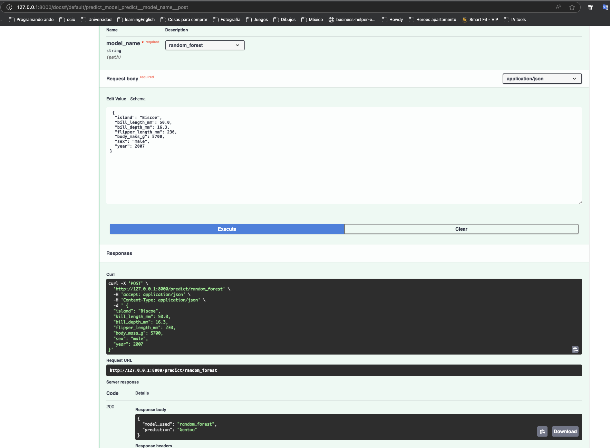

# 🐧 MLOps - Talleres Clasificador de Pingüinos

Este repositorio contiene el código usado para entrenar y desplegar un modelo de predicción de clases de pingüinos basado en el dataset disponible en: [palmerpenguins](https://pypi.org/project/palmerpenguins/).

---

## Creación del modelo

- El dataset se carga usando el método `load_penguins` expuesto en la librería del proyecto `palmerpenguins`.  
- Se convierten columnas categóricas a numéricas usando One-shot Encoding.
- Se hace una escala para mantener la desviación estandar por debajo de 1.
- Se eliminan características no representativas para los modelos(year).
---

## Características principales

- 🐧 ETL completo para preparación de datos  
- 🤖 Entrenamiento de 4 modelos de ML diferentes  
- 🚀 API REST con FastAPI para predicciones  
- 📦 Dockerización lista para despliegue  
- 🔄 Sistema dinámico de selección de modelos  

---

## Instalación y configuración

Clonar el repositorio:

```bash
git clone https://github.com/tu-usuario/penguins-taller-1.git
cd penguins-taller-1
```

## Construcción y ejecución con Docker

Construcción de la imagen Docker:

```bash
docker build -t penguins-api .
```

Ejecución en Docker:

```bash
docker run -p 8989:8989 penguins-api
```

---

## Uso


### 1. Acceder a la interfaz de documentación

Abrir en el navegador:  
[http://localhost:8989/docs](http://localhost:8989/docs)

---

## Uso de la API

### Listar modelos disponibles

```bash
curl http://localhost:8989/models
```

Respuesta:

```json
{
  "available_models": [
    "random_forest",
    "svm",
    "neural_network",
    "linear_regression"
  ]
}
```


### Predecir con selección dinámica de modelo (POST)

```bash
curl -X POST "http://localhost:8989/predict/random_forest" \
-H "Content-Type: application/json" \
-d '{
  "island": "Biscoe",
  "bill_length_mm": 50.0,
  "bill_depth_mm": 16.3,
  "flipper_length_mm": 230,
  "body_mass_g": 5700,
  "sex": "male",
  "year": 2007
}'
```

Respuesta:

```json
{
  "model_used": "random_forest",
  "prediction": "Gentoo"
}
```

---

## Estructura del proyecto

```
penguins-taller-1/
├── models/                   # Modelos entrenados (generados)
├── dto/                      # Objetos de transferencia de datos
│   └── model_prediction_request.py
├── etl.py                    # Extracción, transformación y carga
├── model.py                  # Definición de modelos de ML
├── models.py                 # Tipos de modelos disponibles
├── ModelService.py           # Servicio para manejar modelos
├── penguins.py               # Definición de especies de pingüinos
├── requirements.txt          # Dependencias
├── server.py                 # API con FastAPI
├── test_api.py               # Pruebas de la API
└── Train.py                  # Script de entrenamiento
```

---

## Modelos implementados

- Random Forest - Clasificador de bosques aleatorios  
- SVM - Máquinas de Soporte Vectorial  
- Neural Network - Red neuronal multicapa  
- Linear Regression - Regresión lineal (para propósitos comparativos)  

---


## Especies de pingüinos soportadas

| Especie    | Valor numérico | Descripción             |
|------------|----------------|-------------------------|
| Adelie     | 0              | Pingüinos Adelia        |
| Chinstrap  | 1              | Pingüinos de barbijo    |
| Gentoo     | 2              | Pingüinos papúa         |

---


## Ejemplo de funcionamiento a través de Swagger

