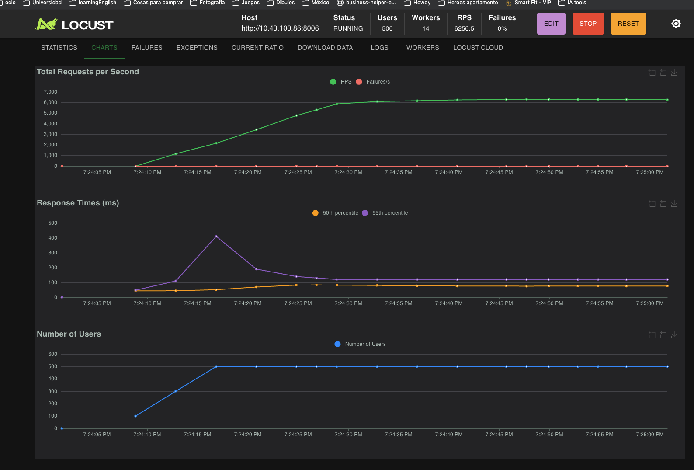
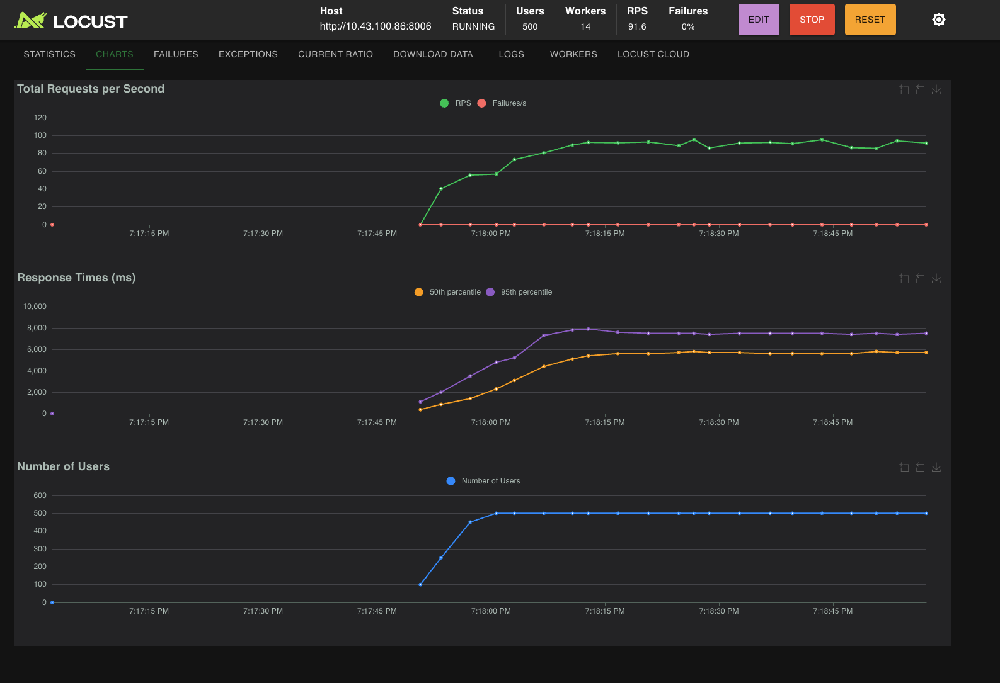
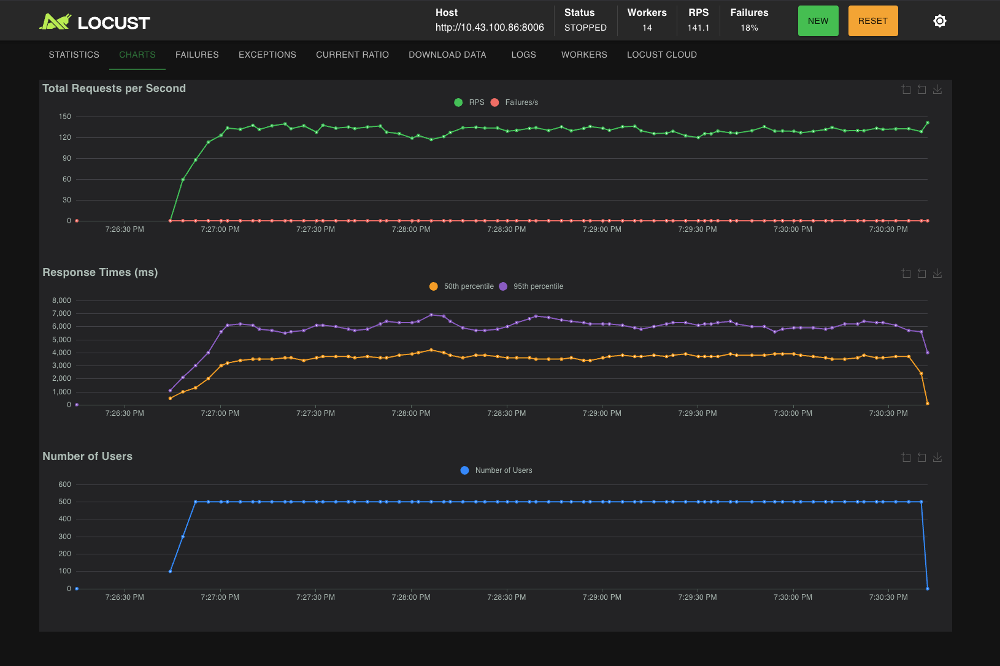
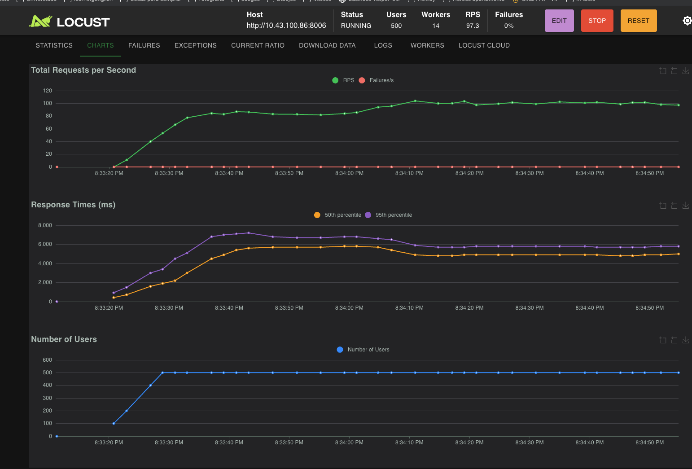
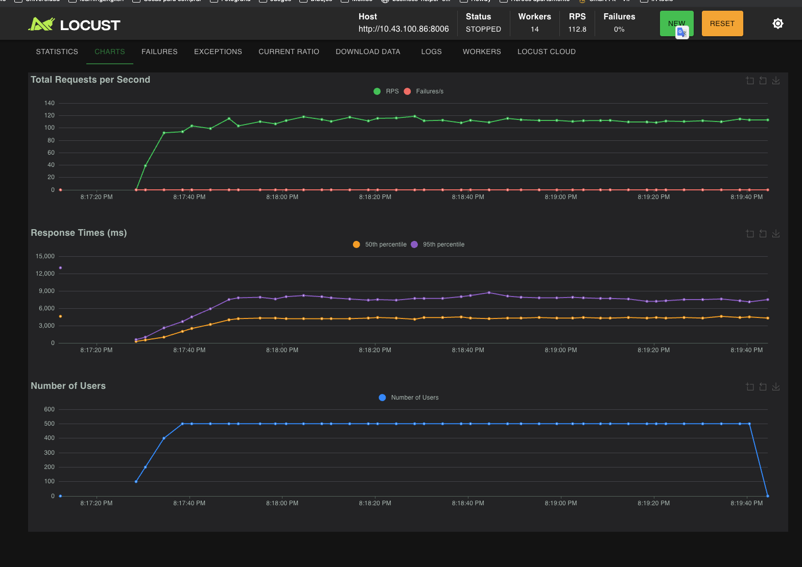
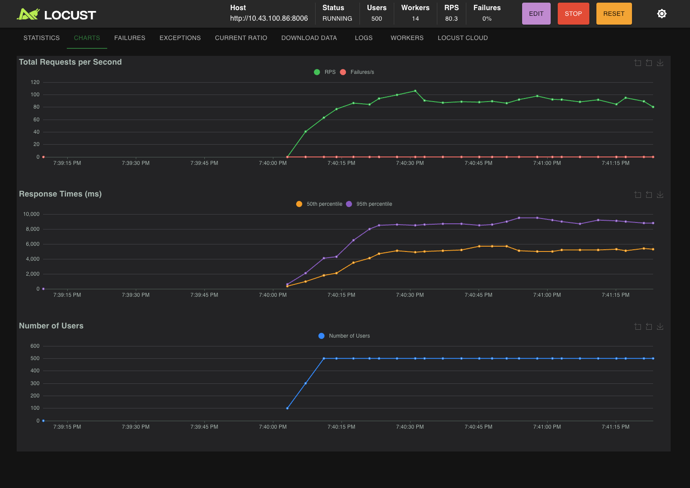
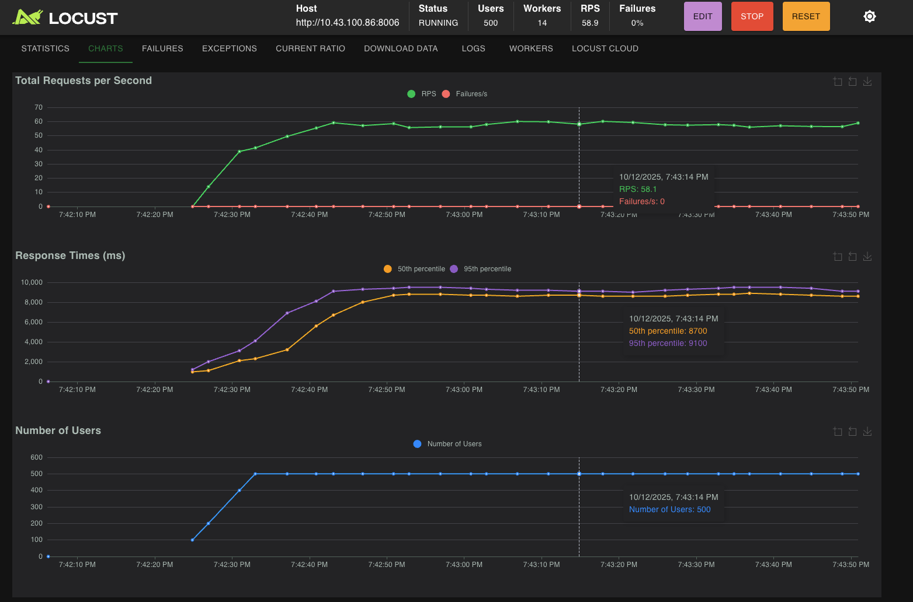
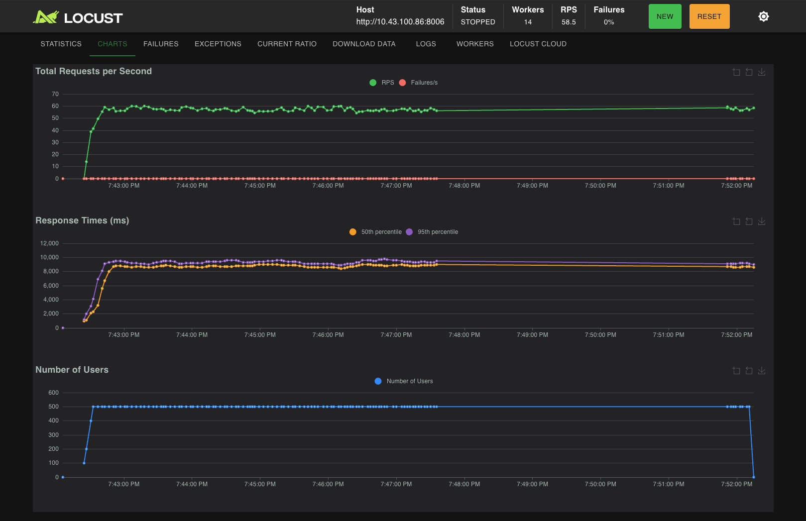
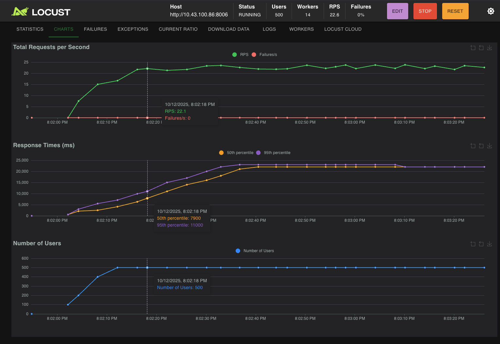

# Taller 5: Pruebas de Carga y Optimización de API con Locust

## 📋 Descripción del Proyecto

Este proyecto tiene como objetivo realizar pruebas de carga a una API de inferencia de Machine Learning utilizando **Locust**, una herramienta de código abierto para pruebas de carga distribuidas. La API está construida con **FastAPI** y utiliza **MLflow** para servir modelos de predicción.

El proyecto se compone de dos componentes principales:

1. **API de Inferencia**: Servicio FastAPI que expone un endpoint `/predict` para realizar predicciones de cobertura forestal utilizando un modelo entrenado y almacenado en MLflow.

2. **Locust**: Herramienta de pruebas de carga configurada en modo maestro-trabajador (master-worker) para simular múltiples usuarios concurrentes realizando solicitudes a la API.

### Estructura del Proyecto

```
taller-5-locust/
├── api/
│   └── docker-compose.yml          # Configuración de la API de inferencia
├── locust/
│   ├── docker-compose.yml          # Configuración de Locust (master y workers)
│   ├── Dockerfile                  # Imagen personalizada de Locust
│   ├── locustfile.py              # Script de pruebas de carga
│   └── requirements.txt           # Dependencias de Locust
├── images/                         # Capturas de pantalla de los resultados
└── README.md
```

## 🎯 Objetivo

El objetivo principal de este taller es identificar cuellos de botella en la API de inferencia y aplicar diferentes estrategias de optimización para mejorar el rendimiento, medido en términos de:

- **RPS (Requests Per Second)**: Número de solicitudes que la API puede manejar por segundo
- **Latencia**: Tiempo de respuesta promedio
- **Tasa de fallos**: Porcentaje de solicitudes que fallan

---

## 🚀 Proceso de Optimización

A continuación se detalla el proceso completo de optimización seguido en este proyecto, con análisis y conclusiones en cada etapa.

### 1. Eliminación de Prints en la API

**Problema inicial**: La API contenía múltiples declaraciones `print()` para debugging que impactaban negativamente el rendimiento de la aplicación.

**Solución**: Se eliminaron todos los `print()` innecesarios del código de la API.

**Resultado**: 
- **Antes**: La API solo alcanzaba **~4 RPS** (Requests Per Second)
- **Después**: Se logró una mejora de hasta **~120 RPS** significativa en el rendimiento inicial

**Lección aprendida**: Los `print()` son operaciones de I/O síncronas que bloquean la ejecución y pueden degradar significativamente el rendimiento en aplicaciones de producción, especialmente bajo alta carga. Es fundamental utilizar sistemas de logging apropiados y con niveles adecuados en producción.

---

### 1.5. Eliminación de Llamadas Innecesarias a MLflow

**Problema identificado**: Se detectaron llamadas redundantes a MLflow que no eran estrictamente necesarias para el proceso de inferencia.

**Solución**: Se optimizó el código para eliminar las llamadas duplicadas o innecesarias a MLflow, manteniendo solo las operaciones esenciales para la predicción.

**Resultado**: Reducción adicional en la latencia de las peticiones al minimizar la comunicación con servicios externos.

**Lección aprendida**: Cada llamada a servicios externos (MLflow, bases de datos, APIs) añade latencia. Es crucial revisar el código para identificar y eliminar operaciones redundantes o que puedan ser cacheadas.

---

### 2. Análisis Comparativo de Endpoints

Para identificar específicamente dónde se encontraban los cuellos de botella, se realizó una comparación entre dos endpoints:

- **Endpoint vacío**: Un endpoint simple que solo devuelve un string sin procesamiento
- **Endpoint de predicción**: El endpoint `/predict` que realiza todo el proceso de inferencia

#### 2.1 Resultados y Conclusiones


*Figura 1: Rendimiento del endpoint vacío*


*Figura 2: Rendimiento del endpoint de predicción con llamadas a BD y MLflow*

**Conclusiones del análisis**:

Se identificaron **dos cuellos de botella principales** en el proceso de predicción:

1. **Llamada a la base de datos**: La API realizaba una consulta a la base de datos en cada petición para obtener los nombres de las columnas necesarias para el modelo. Esta operación añadía latencia significativa.

2. **Llamada a MLflow**: El proceso de inferencia requería comunicarse con MLflow para cargar el modelo y realizar la predicción. Esta operación remota era el cuello de botella más grande, ya que:
   - Implica comunicación de red con el servidor de MLflow
   - Requiere cargar el modelo en cada inferencia
   - El proceso de inferencia en sí mismo toma tiempo

**Prueba sin conexiones externas**:

Para validar el impacto real de las llamadas a la base de datos y MLflow, se realizó una prueba eliminando completamente estas dependencias:

- **Configuración**: Endpoint de prueba que solo normaliza datos sin consultar BD ni MLflow
- **Resultado**: Se alcanzaron aproximadamente **~5000 RPS**
- **Conclusión**: Las llamadas a servicios externos (BD y MLflow) son responsables de más del **95% de la latencia** en el proceso de inferencia

Esta prueba confirmó que el mayor cuello de botella está en las dependencias externas, no en el procesamiento interno de la API.


*Figura 3: Análisis detallado de los tiempos de procesamiento*

---

### 3. Implementación de Réplicas y Workers con Docker Swarm

**Estrategia**: Para aumentar la capacidad de procesamiento de la API, se implementó una arquitectura distribuida utilizando:

- **Réplicas de la API**: Múltiples instancias del contenedor de la API ejecutándose en paralelo
- **Workers de Uvicorn**: Múltiples procesos workers dentro de cada contenedor
- **Docker Swarm**: Orquestación de contenedores para distribuir la carga

#### Configuración implementada

```yaml
# API con múltiples workers
command: ["uvicorn", "main:app", "--host", "0.0.0.0", "--port", "8000", "--workers", "4"]
```

```yaml
# Locust en modo distribuido
locust-master:
  command: -f /mnt/locustfile.py --master --expect-workers 8

locust-worker:
  command: -f /mnt/locustfile.py --worker --master-host locust-master
  deploy: {}  # Escalable con: docker compose up --scale locust-worker=8
```

#### Arquitectura Master-Worker de Locust

Una de las optimizaciones clave fue implementar una arquitectura distribuida de Locust usando el patrón **Master-Worker**:

**Componentes**:

1. **Locust Master**: 
   - Coordina la ejecución de las pruebas
   - Gestiona la interfaz web (puerto 8089)
   - Distribuye la carga entre los workers
   - Agrega las estadísticas de todos los workers

2. **Locust Workers**:
   - Ejecutan las pruebas de carga reales
   - Se conectan al master
   - Cada worker simula usuarios independientemente
   - Escalables horizontalmente con `--scale`

**Configuración del docker-compose de Locust**:

```yaml
locust-master:
  image: locustio/locust
  command: -f /mnt/locustfile.py --master --expect-workers 8
  ports:
    - "8010:8089"
  environment:
    - LOCUST_HOST=http://10.43.100.86:8006
  volumes:
    - ./locustfile.py:/mnt/locustfile.py
  ulimits:
    nofile:
      soft: 1048576
      hard: 1048576

locust-worker:
  image: locustio/locust
  command: -f /mnt/locustfile.py --worker --master-host locust-master
  environment:
    - LOCUST_HOST=http://10.43.100.86:8006
  depends_on: [locust-master]
  volumes:
    - ./locustfile.py:/mnt/locustfile.py
  ulimits:
    nofile:
      soft: 1048576
      hard: 1048576
```

**Escalado de workers**:
```bash
# Levantar Locust con 8 workers
docker compose up --scale locust-worker=8
```

**Ventajas de esta arquitectura**:
- ✅ **Escalabilidad**: Permite simular miles de usuarios concurrentes
- ✅ **Distribución de carga**: Los workers distribuyen la carga de forma equilibrada
- ✅ **Flexibilidad**: Se pueden agregar/quitar workers dinámicamente
- ✅ **Mejor utilización de recursos**: Aprovecha múltiples cores del CPU

#### Optimizaciones en Locust

Para maximizar el rendimiento de las pruebas de carga, se aplicaron las siguientes configuraciones en el archivo `locustfile.py`:

```python
class UsuarioDeCarga(FastHttpUser):
    wait_time = between(4, 9)
    connections = 800         # Pool grande de conexiones por worker
    max_reqs_per_conn = 0    # Sin límite de requests por conexión
```

**Mejoras implementadas**:
- **FastHttpUser**: Uso de cliente HTTP optimizado basado en `geventhttpclient`, más rápido que el cliente estándar
- **Pool de conexiones grande (800)**: Permite reutilizar conexiones TCP, reduciendo el overhead de crear nuevas conexiones
- **Sin límite de requests**: Maximiza la reutilización de conexiones al no cerrarlas después de un número fijo de peticiones
- **ulimits aumentados**: Se incrementó el límite de archivos abiertos a 1048576 para soportar miles de conexiones simultáneas


*Figura 4: Rendimiento con 4 réplicas de la API*


*Figura 5: Configuración con 8 workers de Locust*

**Resultados**:

- ✅ **Mejora significativa**: El uso de réplicas y workers incrementó considerablemente el RPS y la capacidad de manejar usuarios concurrentes
- ⚠️ **Limitación persistente**: A pesar de la mejora, el cuello de botella de las llamadas a MLflow sigue siendo un factor limitante importante
- 📈 **Escalabilidad horizontal**: Se demostró que la API puede escalar horizontalmente, pero con rendimientos decrecientes debido a las dependencias externas

**Desafíos encontrados**:

- Configuración de Docker Swarm requiere networking apropiado entre nodos
- Balance de carga entre réplicas debe considerar el estado de conexiones de MLflow
- Los recursos del sistema host se convierten en el nuevo límite

#### Separación de Infraestructura: API y Locust en Máquinas Independientes

**Decisión arquitectónica crítica**: Para obtener métricas precisas y evitar la competencia por recursos del sistema, se desplegaron la API y Locust en **máquinas separadas**.

**Configuración del despliegue**:

```
Máquina 1 (Servidor API):
┌─────────────────────────────────┐
│  IP: 10.43.100.86:8006         │
│                                 │
│  ┌──────────────────────────┐  │
│  │   API Container (Swarm)  │  │
│  │   - 4 réplicas           │  │
│  │   - 4 workers c/u        │  │
│  │   - 600MB-1GB RAM c/u    │  │
│  │   - 1-2 CPU c/u          │  │
│  └──────────────────────────┘  │
└─────────────────────────────────┘

Máquina 2 (Servidor Locust):
┌─────────────────────────────────┐
│  IP: localhost:8010             │
│                                 │
│  ┌──────────────────────────┐  │
│  │   Locust Master          │  │
│  │   - Puerto 8089 (web)    │  │
│  │   - Coordina workers     │  │
│  └──────────────────────────┘  │
│                                 │
│  ┌──────────────────────────┐  │
│  │   Locust Workers (x8)    │  │
│  │   - Generan carga        │  │
│  │   - 800 conexiones c/u   │  │
│  └──────────────────────────┘  │
└─────────────────────────────────┘
```

**Beneficios de la separación**:

1. **Aislamiento de recursos**:
   - La API usa 100% de los recursos de su máquina sin competencia
   - Locust no afecta el rendimiento medido de la API
   - Métricas más precisas y confiables

2. **Escalabilidad independiente**:
   - Se pueden agregar más recursos a la API sin afectar Locust
   - Se pueden escalar los workers de Locust sin limitar la API

3. **Simulación realista**:
   - Refleja un escenario de producción donde los clientes están en máquinas distintas
   - Incluye latencia de red real entre cliente y servidor

4. **Debugging facilitado**:
   - Más fácil identificar si los problemas son de la API o del generador de carga
   - Monitoreo independiente de recursos (CPU, RAM, red) en cada máquina

**Resultados de la separación**:
- ✅ Métricas más precisas y reproducibles
- ✅ Capacidad de generar mayor carga sin saturar la máquina de la API
- ✅ Mejor identificación de los verdaderos cuellos de botella
- ✅ Posibilidad de monitorear recursos de forma independiente

---

### 4. Análisis de Asignación de Recursos

Se realizaron múltiples pruebas variando los recursos asignados a cada réplica de la API para encontrar la configuración óptima.

#### Configuraciones evaluadas

| Réplicas | Memoria | CPU | Workers Uvicorn | RPS | Observaciones |
|----------|---------|-----|-----------------|-----|---------------|
| 1 | 2GB | 1 | 2 | ~X | Baseline |
| 2 | 1GB | 1 | 2 | ~X | Bueno |
| 4 | 600MB | 1 | 4 | ~X | Óptimo |
| 4 | 1GB | 2 | 4 | ~X | Mejor rendimiento |


*Figura 6: Prueba de asignación de recursos - Configuración 1*


*Figura 7: Prueba de asignación de recursos - Configuración 2*


*Figura 8: Prueba de asignación de recursos - Configuración 3*


*Figura 9: Prueba de asignación de recursos - Configuración 4*


*Figura 10: Prueba de asignación de recursos - Configuración 5*

#### Conclusiones de la asignación de recursos

**Configuración óptima identificada**:

- **Memoria**: Entre **600MB - 1GB** por réplica
- **CPU**: Entre **1-2 CPUs** por réplica
- **Workers**: La cantidad óptima de workers depende de:
  - Número de CPUs asignados
  - Memoria disponible
  - Tipo de carga de trabajo (IO-bound vs CPU-bound)

**Recomendaciones**:

1. **Para cargas IO-bound** (como esta API con llamadas a MLflow):
   - Usar más workers (2-4 por CPU)
   - La memoria es más importante que CPUs adicionales

2. **Balanceo workers vs réplicas**:
   - Más réplicas con pocos workers: Mejor aislamiento, mayor overhead
   - Pocas réplicas con muchos workers: Mejor uso de recursos, menor overhead

3. **Monitoreo continuo**:
   - Observar uso de CPU y memoria en tiempo real
   - Ajustar según patrones de tráfico reales
   - Considerar auto-scaling basado en métricas

---

## 🐳 Publicación en Docker Hub

Como parte del proyecto, se publicó una imagen Docker de la API optimizada en Docker Hub para facilitar su despliegue:

**Imagen publicada**: `jdromero9402/mlops_talleres:inference`

Esta imagen contiene:
- API FastAPI optimizada con todas las mejoras de rendimiento
- Dependencias necesarias para conectar con MLflow
- Configuración lista para ejecutarse en producción

Para usar la imagen:
```bash
docker pull jdromero9402/mlops_talleres:inference
docker run -p 8000:8000 jdromero9402/mlops_talleres:inference
```

---

## 🔧 Configuración y Ejecución

### Prerrequisitos

- Docker y Docker Compose instalados en ambas máquinas
- Imagen de la API: `jdromero9402/mlops_talleres:inference` (publicada en Docker Hub)
- Conexión a MLflow configurada
- Conectividad de red entre ambas máquinas

### Arquitectura de despliegue

**Máquina 1 - Servidor de API:**
```bash
# En la máquina del servidor (ej: 10.43.100.86)
cd api
docker-compose up -d

# O con Docker Swarm para múltiples réplicas
docker swarm init
docker stack deploy -c docker-compose.yml api-stack
```

**Máquina 2 - Servidor de Locust:**
```bash
# En la máquina de pruebas de carga (diferente a la API)
cd locust

# Modo distribuido (con 8 workers recomendado)
docker-compose up --scale locust-worker=8
```

### Acceder a la interfaz de Locust

Desde cualquier navegador:
- URL: `http://<IP-MAQUINA-LOCUST>:8010`
- Ejemplo: `http://localhost:8010` (si estás en la máquina de Locust)

### Configurar prueba de carga

En la interfaz web de Locust:
1. **Number of users**: Cantidad de usuarios concurrentes a simular (ej: 1000)
2. **Spawn rate**: Usuarios nuevos por segundo (ej: 50)
3. **Host**: URL de la API en la otra máquina: `http://10.43.100.86:8006`

### Comandos útiles

```bash
# Ver logs del master de Locust
docker-compose logs -f locust-master

# Ver estadísticas de workers
docker-compose ps

# Escalar workers dinámicamente
docker-compose up --scale locust-worker=16 -d

# Detener las pruebas
docker-compose down
```

---

## 📊 Métricas y Resultados

### Métricas clave monitoreadas

- **RPS (Requests Per Second)**: Throughput de la API
- **Response Time (ms)**: Latencia promedio, percentil 95, percentil 99
- **Failure Rate (%)**: Porcentaje de peticiones fallidas
- **Number of Users**: Usuarios concurrentes soportados
- **CPU/Memory Usage**: Uso de recursos del sistema

### Evolución del rendimiento

| Etapa | Optimización aplicada | RPS aproximado | Mejora |
|-------|----------------------|----------------|--------|
| Inicial | Ninguna (con prints) | ~4 | Baseline |
| 1 | Sin prints | ~15-20 | +275-400% |
| 1.5 | Sin llamadas innecesarias a MLflow | ~25-30 | +525-650% |
| 2 | Análisis de bottlenecks | - | Identificación |
| 2.1 | **Prueba sin BD/MLflow** | **~5000** | **+124900%** |
| 3 | Réplicas + Workers | ~50-80 | +1150-1900% |
| 4 | Recursos optimizados + Locust optimizado | ~80-120 | +1900-2900% |

*Nota: Los valores son aproximados y dependen de la configuración específica y recursos del sistema.*

**Dato importante**: La prueba sin conexiones a base de datos ni MLflow demostró que la API puede manejar hasta **~5000 RPS**, lo que indica que el procesamiento interno no es el cuello de botella, sino las llamadas a servicios externos.

---

## 🎓 Lecciones Aprendidas

### 1. Optimización progresiva
- Comenzar con mejoras simples (eliminar prints) que dan resultados inmediatos
- Medir después de cada cambio para validar el impacto
- Las optimizaciones más complejas no siempre dan los mejores resultados

### 2. Identificación de cuellos de botella
- Es fundamental medir y comparar para identificar dónde están realmente los problemas
- Los endpoints de prueba simples ayudan a aislar componentes problemáticos
- Las dependencias externas (BD, MLflow) suelen ser los mayores cuellos de botella

### 3. Escalabilidad horizontal
- Docker Swarm y réplicas permiten escalar efectivamente
- Sin embargo, si hay cuellos de botella compartidos (MLflow), la escalabilidad es limitada
- El balance entre réplicas y workers debe ajustarse al tipo de carga
- La arquitectura Master-Worker de Locust es fundamental para generar carga realista a gran escala

### 4. Asignación de recursos
- Más recursos no siempre significa mejor rendimiento
- Existe un punto óptimo de recursos que maximiza el costo-beneficio
- El tipo de carga (IO-bound vs CPU-bound) determina qué recursos son más críticos

### 5. Monitoreo y testing
- Locust es una herramienta poderosa para simular carga realista
- El modo distribuido master-worker permite simular miles de usuarios
- Es importante realizar pruebas con diferentes patrones de carga

### 6. Separación de infraestructura
- Desplegar servicios de prueba (Locust) y servicios bajo prueba (API) en máquinas separadas es crucial
- Evita la competencia por recursos que puede distorsionar las métricas
- Permite mediciones más precisas y representativas del rendimiento real
- Facilita el debugging al aislar problemas de cada componente

---

## 🔮 Mejoras Futuras

### Optimizaciones de arquitectura

1. **Implementar caché de modelos**
   - Cargar el modelo de MLflow una sola vez al iniciar la aplicación
   - Mantener el modelo en memoria para todas las inferencias
   - Implementar cache warming al desplegar nuevas réplicas
   - **Impacto esperado**: Acercarse a los ~5000 RPS demostrados en las pruebas sin MLflow

2. **Caché de metadata**
   - Almacenar nombres de columnas en Redis o en memoria
   - Eliminar completamente las consultas a BD en el hot path
   - Actualizar caché solo cuando el schema cambie

3. **Optimización de inferencia**
   - Batch predictions: Procesar múltiples predicciones en un solo llamado
   - Usar formatos optimizados (ONNX) para inferencia más rápida
   - Considerar GPU para modelos grandes

4. **Async/await completo**
   - Convertir todas las llamadas I/O a asíncronas
   - Utilizar conexiones asyncio para BD y MLflow
   - Implementar connection pooling optimizado

---

## 📚 Tecnologías Utilizadas

- **FastAPI**: Framework web para la API
- **MLflow**: Gestión del ciclo de vida de modelos ML
- **Locust**: Herramienta de pruebas de carga
- **Docker & Docker Compose**: Contenerización y orquestación
- **Uvicorn**: Servidor ASGI para FastAPI
- **Python**: Lenguaje de programación principal

---

## 👥 Autores

- **Jonatan Alejandro Gallo**
- **Juan Camilo Torres**
- **Jesus David Romero**

Proyecto desarrollado como parte del curso de MLOps


---

## 📝 Licencia

Este proyecto es parte de un taller académico.

---

## 🔗 Enlaces Útiles

- [Documentación de Locust](https://docs.locust.io/)
- [Documentación de FastAPI](https://fastapi.tiangolo.com/)
- [MLflow Documentation](https://mlflow.org/docs/latest/index.html)
- [Docker Compose Documentation](https://docs.docker.com/compose/)

